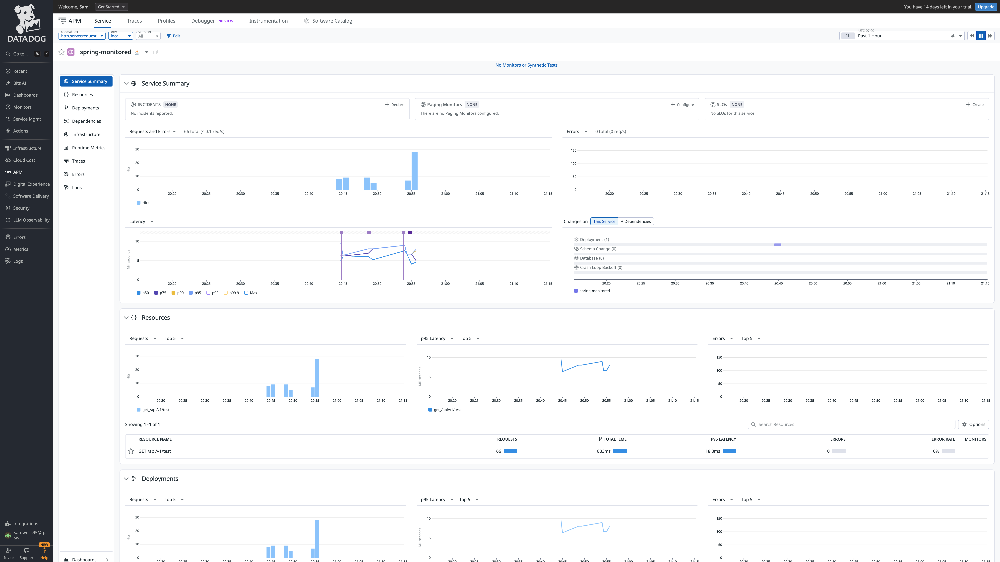

# spring-monitored
Spring Boot service with logging and metrics. Will probably use this as a base for other services if metrics are needed.

# Logs, tracing and metrics collection
Logs, metrics and traces are collected via the [OpenTelemetry agent](https://opentelemetry.io/docs/zero-code/java/agent/) (see [Dockerfile](Dockerfile)).
This is achieved by dynamically injecting bytecode when the spring-monitored service is running in the JVM.

They are then shipped over to the datadog agent, which is running in a separate container. This container then sends them
to the hosted DataDog application, allowing the logs, metrics and traces to be viewable in the UI.

# Logging

Logging is configured to use SLF4J (Simple Logging Facade for Java) and Log4J2. The defaut logback logger is disabled via exclusions in [build.gradle.kts](build.gradle.kts). SLF4J is a facade over the underlying logging implementation, which in this case is Log4J2. This means we can use SLF4J in our code, but the logging implementation is Log4J2 and that implementation can easily be swapped out without the need for code changes. Log4j2 configuration is done in [log4j2.xml](src/main/resources/log4j2.xml).
